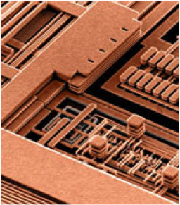

# Einleitung

## Lernziele des Moduls

* Einblicke in mikroelektronische Systeme

* Analyse und Funktion von Halbleiterbauelementen
  * Halbleiterphysik
  * Modellbildung
  * Netzwerkanalyse/-synthese

* Anwendung von SPICE in der Schaltunganalyse
  * Spezifikation
  * Partitionierung
  * Design

* Einsatz von Entwicklungsboards, Embedded Systems / System-on-Chip (SoC)
  * STEMlab von [Red Pitaya](https://www.redpitaya.com)

## Wissenschaftliches Rechnen

* [Python (Anaconda)](https://www.anaconda.com/download/)

* [Matlab (Campus Lizenz)](https://de.mathworks.com/academia/tah-portal/hochschule-bremen-31463273.html)

* [Command-line tools](https://jeroenjanssens.com/seven/) 

## Schaltungsentwurf (EDA Tools)

* PCB / System Design
  * [LTspice](https://www.analog.com/en/design-center/design-tools-and-calculators/ltspice-simulator.html)
  * [KiCad EDA](https://www.kicad.org/)
  * [Altium Designer](https://www.altium.com/de/altium-designer)
  * [SiemensEDA PCB tools](https://eda.sw.siemens.com/en-US/pcb/products/)
  * [cadence System Design & Analysis](https://www.cadence.com/en_US/home/tools/system-design-and-analysis.html)

* IC / Silicon Design
  * [IIC-OSIC-TOOLS (open-source)](https://github.com/iic-jku/IIC-OSIC-TOOLS)
  * [SiemensEDA IC tools](https://eda.sw.siemens.com/en-US/ic/products/)
  * [cadence IC Design & Verification](https://www.cadence.com/en_US/home/tools/design-excellence.html)
  * [synopsys silicon design (IC)](https://www.synopsys.com/silicon-design.html)

## OS-Tools

* [Microsoft-Terminal](https://github.com/microsoft/terminal)

* [Microsoft-PowerShell](https://learn.microsoft.com/de-de/powershell/scripting/learn/ps101/01-getting-started?view=powershell-7.4)

* [MacOS-Terminal](https://iterm2.com)

* [Linux/MacOS Shell zsh-tools](https://ohmyz.sh),

* [git (Versionskontrolle)](https://git-scm.com)

## Code Editoren

* [Visual Studio Code](https://code.visualstudio.com)

* [Spyder IDE](https://www.spyder-ide.org)

* [Thonny (Micro-)Python IDE](https://thonny.org)

* [Emacs](https://www.gnu.org/software/emacs/)

* [Vim](https://www.vim.org)

## Data Science

* Dateisystem: Dateien- und Ordnerstruktur

* Tabellenformate: Comma/Tab-Separated-Values (CSV/TSV), Spreadsheet (.xlsx, .ods)

* Spezielle Formate, z.B. MATLAB mat, HDF5

* Embedded [Datenbanken](https://db-engines.com)
  * [SQL](https://en.wikipedia.org/wiki/SQL), z.B. [SQlite](https://en.wikipedia.org/wiki/SQLite)
  * [OLAP](https://en.wikipedia.org/wiki/Online_analytical_processing), z.B. [DuckDB](https://duckdb.org/why_duckdb)
  

## Publish Computational Content

* [Jupyter-Book](https://jupyterbook.org/en/stable/intro.html)

* [quarto](https://quarto.org)

## Schreibst Du noch oder TeXst Du schon?

* [MikTeX (Windows, MacOS, Linux)](https://miktex.org/)

* [MacTeX (MacOS)](https://www.tug.org/mactex/)

* [TeXLive (Linux)](http://tug.org/texlive/)

## LaTeX Editoren

* IDE's
  * [TeXStudio](http://www.texstudio.org)
  * [TeXMaker](http://www.xm1math.net/texmaker/)

* Kollaborative Frameworks
  * [Overleaf, Online LaTeX](https://www.overleaf.com/)
  * [CoCalc - Online LaTeX](https://cocalc.com/doc/latex-editor.html)

## Literaturverwaltung und LaTeX

* [Citavi im Detail > Titel exportieren > Export nach BibTeX](https://www1.citavi.com/sub/manual5/de/exporting_to_bibtex.html)

* [RefWorks - Library Guide Univ. Melbourne](https://unimelb.libguides.com/c.php?g=565734\&p=3912294)

* [Benutzerdefinierte BibTex-Keys mit Zotero | nerdpause](https://nerdpause.de/benutzerdefinierte-bibtex-keys-mit-zotero/)

* [JabRef - Library Guide Univ. Melbourne](https://unimelb.libguides.com/c.php?g=565734\&p=3897117)

* [EndNote - Library Guide Univ. Melbourne](https://unimelb.libguides.com/latexbibtex/endnote)

## Experimentelle Arbeit - Entwurf elektronischer Systeme

Analyse und Synthese von elektronischen Bauelementen und Systemen mit 

* Modellbildung auf Systemebene / Verhaltensmodellierung
  
* Simulation auf Schaltungsebene / SPICE

* Charakterisierung auf Hardwareebene mit

  * [Analog System Lab Kit ASLK Pro](https://aslk-pro.readthedocs.io/de/latest/)

  * [Red Pitaya's STEMlab 125-14/10](https://redpitaya.readthedocs.io/en/latest/developerGuide/125-14/top.html)

* Technische Dokumentation mit [quarto](https://quarto.org)

## Analyse vs. Design

* Entgegen populärwissenschaftlicher Meinungen ist Schaltungsanalyse und Schaltungsentwurf keine "Schwarze Magie"

* Schaltungsanalyse
  * ist die Fähigkeit, Schaltungen in handhabbare Teile zu zerlegen
  * basierend auf einem einfachen, aber hinreichend genauen Modell
  * "Just-in-time" Modellierung – verwende kein komplexes Modell, so lange es nicht benötigt wird ...
  * eine Schaltung $\Rightarrow$ eine Lösung

* Schaltungsentwurf
  * ist die Fähigkeit der Schaltungssynthese auf Basis von Erfahrung und intensiver Analyse
  * eine Spezifikation  $\Rightarrow$ viele Lösungen
  * Entwurfspraktiken werden am besten durch’s "Selbermachen" ausgebildet – daher ein Entwurfsprojekt ...

## Es war einmal ...

## Damals und heute

## Packungsdichten

## Moore'sches Gesetz

<!-- [50 Jahre Moore's Gesetz](https://www.intel.com/content/www/us/en/silicon-innovations/moores-law-technology.html) -->
<!--  -->



## Chip Manufacturing - How are Microchips made? (Infineon, Dresden)


 

## FinFET (Intel)



## TSMC Fab (Next Gen 7/5 nm)



## Reiseaussichten

Dies ist der **Beginn eines Prozesses**,

besser noch, **eines Abenteuers**.

## Reiseziele

* Mehr über Signale wissen, die in elektronischen Systemen verarbeitet werden.

* Schaltungsdiagramme lesen können.

* Wissen über grundlegende Blöcke eines Systems aneignen.

* Wissen, wie Transistoren arbeiten und in modernen integrierten Technologien hergestellt werden.

* Eigenarten der Modellierung mikroelektronischer Bauelemente und der physikalischen und chemischen Prinzipien im
  Herstellungsprozess kennenlernen. 

## Reisebedingungen

*Anwendung Ihres Werkzeugkastens.* 
* Grundlagen der Elektrotechnik/Physik

* Elektromagnetische Wellen

* Angewandte Mathematik und Systemtheorie

* Trainingswille

* Pioniergeist

* Spa{\ss}

*Schnallen Sie sich an, die Reise beginnt ...*

## Systemhierarchie

## System Assembly

Entnommen den Vorlesungsfolien von @maloberti2011.

## Schnittstellen zur Aussenwelt

Entnommen den Vorlesungsfolien von @maloberti2011.

## Meeting mit einem System

Entnommen den Vorlesungsfolien von @maloberti2011.

## System in a Package (SiP)

Entnommen den Vorlesungsfolien von @maloberti2011.

## Backend Phasen

* Packaging

* Zuverlässigkeit = Qualität auf Zeit

* Testing auf Wafer Level, known good die (KGD)

  * Burn-in und Accelerated Aging (thermischer Stress, Arrhenius Gesetz)
  
  * Automatic Test Equipment (ATE)
    * System Probe
    * Interconnect Test
    * Build-in Self-Test (BIST)

* Statistische Datenanalyse und Yield Prognosen

  * Ausfallrate FIT (failure in time)
  
  * Badewannenkurve

## Sie werden Experte

*Leistungsmerkmale.* 

* Hintergrundwissen
  * Systemverständnis, Architektur, Herstellungsverfahren, Implementation

* Unterbewusste Kompetenz
  * Abgespeicherte Erfahrungen aus Erfolgsgeschichten und Misserfolgen

* Spezialwissen
  * Berufsspezifisches Wissen

* Teamwork Haltung
  * Kommunikationsfähigkeit, Berichtswesen und technische Präsentation

* Kreativität

* Tool-Kenntnisse

## Evolution von Produkten

* Angetrieben durch Technologieverbesserung
  * Kosten (größere Chips, geringere Größe der Merkmale, bessere Ausbeute)
  * Leistung (neue Bauteile, höhere Geschwindigkeit, weniger Stromverbrauch)

* Angetrieben durch Verbesserung der Entwurfsmethodik
  * Architektur (Leistung, Funktionen)
  * CAD (Entwicklungskosten, Time-to-Market)

* Komplexität der Designs verdoppelt sich jedes Jahr (Moore's Gesetz)

* Rolle von CAD
  * Verbesserung der Produktivität von Konstruktionsprozessen
  * Reduzierung der Komplexität für den Konstrukteur
  * Sicherstellung des ordnungsgemäßen Betriebs der Geräte

## EDA Kompetenz

* EDA-Anbieter (Tool-Entwickler)
  * Identifikation von Entwurfsaufgaben, Bedarf an Werkzeugen
  * Entwicklung von Strategien und Algorithmen
  * Implementierung von Software-Werkzeugen
  * Verifikation der Stabilität und Funktionalität der Software-Tools

* IC-Hersteller
  * Entscheidungsplanung, welches Tool die Produktivität steigern könnte
  * EDA-Tool-Manager, Installation und Wartung
  * Experten für Softwareeinsatz, Anwendung in Produktdesign und -entwicklung

* Dozenten und Studenten
  * Jobchancen
  * Notwendigkeit, auf dem Laufenden zu bleiben

## Design-/Entwurfsmethodik

* Full Custom - vollständig manuell: ASIC
  * Überwiegend analoge Schaltungen
  * Einfache digitale Gatter
  * Volle Kontrolle, aber lange Entwicklungszeit (bis zu Jahren)

* Semi-custom: ASIC-Fertigung mit Verwendung von vorgefertigten Teilen
  * Standardzellen, Makrozellen, IP's
  * Wiederverwendung von vordefinierten Blöcken oder Maskensätzen
  * Eingeschränkte Kontrolle/Flexibilität, aber kürzere Entwicklungszeit (bis zu Wochen)

* Vollständig automatisiert: Keine Fertigung, reprogrammierbare ASICs
  * FPGA, PLA
  * Ausschließlich digitale Schaltungen
  * Schnelles Prototyping

## Nachhaltige Elektronik ...



## Warum es sicht lohnt ...



## Und ab an den Strand ...


