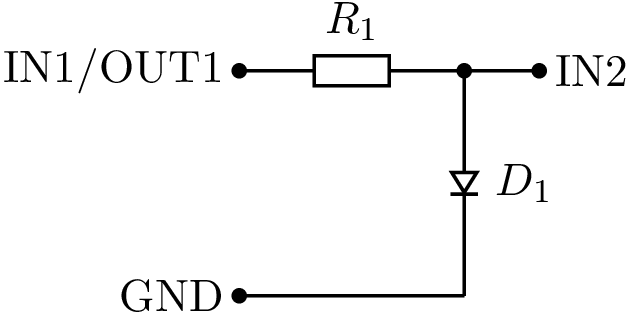
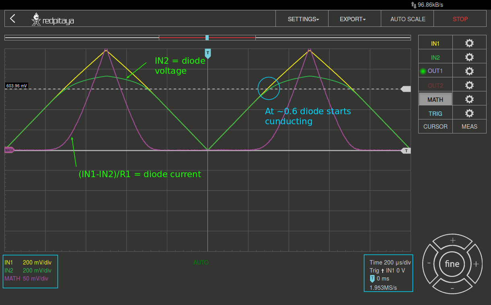
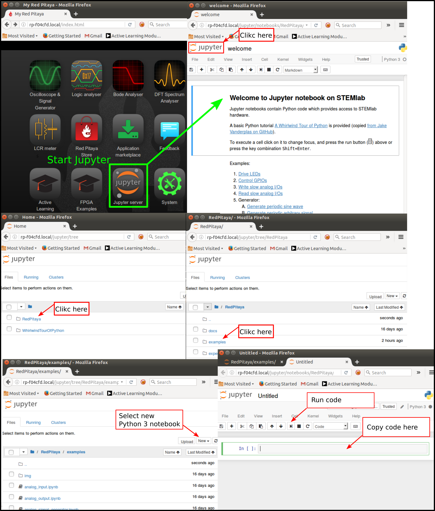
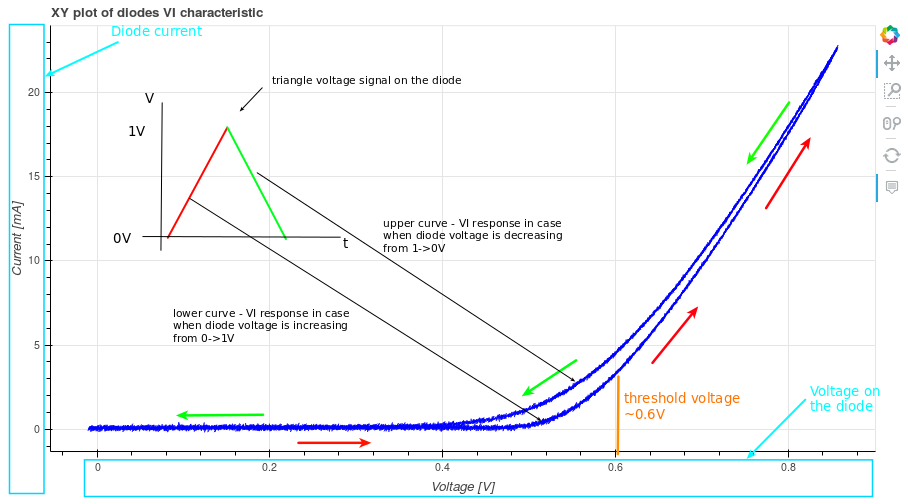

<!-- !split -->
<!-- jupyter-book 02_Activity.md -->

# Dioden IV-Charakterisierung

### Zielsetzung

Ziel dieses Laborversuchs ist es, Strom- und Spannungseigenschaften zwei verschiedener Siliziumdiode vom Typ 1N4001 und 1N4148 zu
untersuchen. Parallel zu Messungen am Red Pitaya STEMlab muss die Schaltung vollständig in LTSpice simuliert werden, so
dass die Messdaten aus dem STEMLab auf dem eigenen Rechner verglichen (validiert) werden können.

*Hinweis.*
In diesem Laborversuch wird die Terminologie aus der [Dokumentation](https://redpitaya.readthedocs.io/en/latest/index.html)
verwendet, wenn es um Verbindungen zum 
[Red Pitaya STEMlab](https://redpitaya.readthedocs.io/en/latest/developerGuide/hardware/125-14/top.html) geht.

Die Erweiterungsstecker-Pins für die Spannungsversorgung -3.3 V und +3.3 V sind in der
[Dokumentation](https://redpitaya.readthedocs.io/en/latest/developerGuide/hardware/125-14/extent.html)
dargestellt.

Die [Oszilloskop und Signalgenerator App](https://redpitaya.readthedocs.io/en/latest/appsFeatures/applications/oscSigGen/osc.html)
wird zum Erzeugen und Beobachten von Signalen in der Schaltung verwendet, wenn der Web-Server des STEMLab's aktiviert
ist.

### Hintergrund

Eine Halbleiterdiode ist ein elektronisches Bauelement, welches häufig in Schaltungsanwendungen, bei denen der Strom nur
in eine Richtung fliessen darf, als Gleichrichtung eingesetzt wird.

Wenn die Diode aus Silizium hergestellt wird, liegt die Durchlaßspannung typischerweise bei $\approx$ 0.7 V und die
IV-Charakteristik im Bezug auf Diodenstrom und -spannung kann durch eine exponentielle Beziehung beschrieben werden:

$$
\begin{equation}
I_D = I_S \left( e^{\frac{V_D }{N V_T}} - 1 \right)
\end{equation}
$$

wobei $I_{S}$ der Sättigungssperrstrom ist und $N$ ein Skalierungsfaktoren (Emissionskoeffizient), $V_T = kT / q$ ist
die sogenannte thermische Spannung und beträgt 25,4 mV bei Raumtemperatur ($T$=300 K). 

### Schematische Symbole der Diode

Jeder Diodentyp hat ein spezifisches Schaltsymbol, welches vom herkömmlichen Diodensymbol der Siliziumdiode abgeleitet
ist, [Figure](19_fig_01.html#19_fig_01). Eine etwa "Z"-förmige Kathode bezeichnet eine Zener-Diode, wie im zweiten Symbol von links
in [Figure](19_fig_01.html#19_fig_01) zu sehen ist. Eine "S"-förmige Kathode bezeichnet eine Schottky-Diode und Pfeile, die von der
Diode wegzeigen, kennzeichnen eine LED (engl. Light Emitting Diode), wie im rechten Symbol dargestellt. Pfeile, die auf
die Diode zeigen, kennzeichnen eine Photodiode. 

<!-- 
<em>Diodensymbole. 

</em>
 -->

### Materialien

* Red Pitaya STEMlab
* 10 $\Omega$ Widerstand
* Diode 1N4148
* Diode 1N4001
* Platine

### pn-Übergangsdiode IV-Charakteristik

Die Strom-/Spannungseigenschaften der pn-Übergangsdiode können mit dem STEMlab und den folgenden in [Figure](19_fig_04.html#19_fig_04)
dargestellten Anschlüssen gemessen werden. Richten Sie die Steckplatine mit dem Generator OUT1-Kanalausgang an einem
Ende des Widerstandes ein. Das andere Ende des Widerstandes ist mit einem Ende der zu messenden Diode verbunden, wie im
Diagramm dargestellt. Die Eingangskanäle IN1 und IN2 sind ebenfalls unterschiedlich angeschlossen, daher werden
Diodenstrom und -spannung:

$$
\begin{align}
I_D &= (IN_1 - IN_2) / R_1 \\
V_D &= IN_2
\end{align}
$$

<!-- 
<em>Anschlussplan für Dioden IV-Kurven. 

</em>
 -->

Zur Messung der Strom- und Spannungseigenschaften einer pn-Übergangsdiode sollte der OUT1-Generator als 1 kHz-Dreieckssignal
mit einer maximalen Amplitude von 1 V und einer minimalen Amplitude von 0 V konfiguriert werden. Für die Messung der
IV-Kurve ist ein zweidimensionaler (xy) Graph (Plot) erforderlich, wobei die x-Achse die Diodenspannung IN2 und die
y-Achse den Diodenstrom $I_D=(IN1-IN2)/R1$ darstellen.

*Warning.* 
BITTE NIEMALS UNTERSCHIEDLICHE ZUGRIFFSARTEN PARALLEL VERWENDEN.

Deaktivieren Sie die Oszilloskop-App (OFF-Button), bevor Sie den Zugriff mit Jupyter Notebook oder SCPI erproben.

### Zeitbereichsmessungen

<!-- 
<em>Verbindungen auf dem Steckbrett. 

</em>
 -->

* Die Schaltung aus [Figure](19_fig_04.html#19_fig_04) ist für Sie auf einer Platine aufgebaut und angeschlossen.
* Starten Sie die Oszilloskop- und Signalgenerator-App auf einem Red Pitaya.
* Stellen Sie im Menü OUT1-Einstellungen den Amplitudenwert auf 0,5 V und den DC-Offset auf 0,5 V ein, um ein Dreieckssignal als Eingangsspannung anzulegen. Im Waveform-Menü das Signal "TRIANGLE" auswählen und den Ausgang mit "ON" aktivieren. Der "SHOW"-Button dient zum Anzeigen des Signals in der Oszilloskop-App.
* Stellen Sie sicher, dass sowohl IN1 V/div als auch IN2 V/div am linken unteren Bildschirmrand auf 200 mV/div eingesetellt sind. V/div können Sie im jeweiligen Kanal über die +/- Schaltflächen rechts unten kontrollieren.
* Setzen Sie den t/div-Wert auf 200 us/div. Auch hier können Sie t/div mit den +/- Schaltflächen einstellen.
* Im Menü "MATH settings" die Differenz IN1-IN2 einstellen und "enable" auswählen. Die mathematische Kurve skaliert mit dem Faktor R1 und stellt den Diodenstrom dar.

<!-- 
<em>Spannung und Strom einer Siliziumdiode (zeitabhängig). 

</em>
 -->

Aus [Figure](19_fig_06.html#19_fig_06) kann man sehen, dass die Diode zu leiten beginnt, wenn die Diodenspannung die
Schwellenspannung von ca. 0.7 V erreicht.  

Außerdem sollte der mit "MATH-Trace" dargestellte Diodenstrom beobachtet werden. Man sollte deutlich erkennen, dass der
Diodenstrom 0 A beträgt, sobald die Diodenspannung unter 0.7 V liegt. Ab einem Zeitpunkt, ab dem die Diodenspannung
$> 0.7\,\text{V}$ ist, beginnt die Diode zu leiten und der Pfadstrom wird nur durch den Widerstand $R_1$ begrenzt.

### Vorgehensweise - Messung der I/V-Charakteristik

Für diese Aufgabe verwenden Sie die Steuerung des STEMLabs mittels SCPI-Server und Python aus dem VPN der Hochschule am zugewiesenen
Laborplatz.

Die IP-Adressen der STEMLabs für den Zugriff via SCPI:

* Laborplatz ELIE1: 192.168.111.181
* Laborplatz ELIE2: 192.168.111.182
* Labroplatz ELIE3: 192.168.111.183
* Laborplatz ELIE4: 192.168.111.184
* Laborplatz ELIE5: 192.168.111.185
* Laborplatz ELIE6: 192.168.111.186

Die URLs der STEMLabs für den Zugriff via Web-Server aus dem VPN der HSB:

* [Laborplatz ELIE1](http://elie1redpi.fk4.hs-bremen.de)
* [Laborplatz ELIE2](http://elie2redpi.fk4.hs-bremen.de)
* [Labroplatz ELIE3](http://elie3redpi.fk4.hs-bremen.de)
* [Laborplatz ELIE4](http://elie4redpi.fk4.hs-bremen.de)
* [Laborplatz ELIE5](http://elie5redpi.fk4.hs-bremen.de)
* [Laborplatz ELIE6](http://elie6redpi.fk4.hs-bremen.de)

Wie Sie Jupyter Notebook auf einem Red Pitaya starten und ein neues Projekt erstellen, ist in [Figure](19_fig_07.html#19_fig_07) dargestellt.

<!-- 
<em>Erstellen eines neuen Jupyter Notebooks. 

</em>
 -->

Wenn Sie erfolgreich ein neues Jupyter Notebook erstellt haben, kopieren Sie den untenstehenden Code in eine Zelle
hinein und führen ihn aus. Der untenstehende Code erzeugt das gleiche Signal wie in [Figure](19_fig_06.html#19_fig_06), aber er
zeichnet die Messdaten in einem xy-Diagramm auf. Für die Messung der IV-Kurve der Diode ist die x-Achse (Abszisse) die
Diodenspannung an IN2 und die y-Achse (Ordinate) der Diodenstrom $I_D = (IN1-IN2)/R_1$.   

~~~{.Python}
# Import libraries
from redpitaya.overlay.mercury import mercury as overlay

from bokeh.io import push_notebook, show, output_notebook
from bokeh.models import HoverTool, Range1d, LinearAxis, LabelSet, Label
from bokeh.plotting import figure, output_file, show
from bokeh.resources import INLINE
output_notebook(resources=INLINE)

import numpy as np

# Initialize fpga modules
fpga = overlay()
gen0 = fpga.gen(0)
osc = [fpga.osc(ch, 1.0) for ch in range(fpga._MNO)]

# Configure OUT1 generator channel
gen0.amplitude = 0.5
gen0.offset = 0.5
gen0.waveform = gen0.sawtooth(0.5)
gen0.frequency = 2000
gen0.start()
gen0.enable = True
gen0.trigger()

# R1 resistor value
R1 = 10

# Configure IN1 and IN2 oscilloscope input channels
for ch in osc:
    ch.filter_bypass = True

    # data rate decimation
    ch.decimation = 10

    # trigger timing [sample periods]
    N = ch.buffer_size
    ch.trigger_pre = 0
    ch.trigger_post = N

    # osc0 is controlling both channels
    ch.sync_src = fpga.sync_src["osc0"]
    ch.trig_src = fpga.trig_src["osc0"]

    # trigger level [V], edge ['neg', 'pos'] and holdoff time [sample periods]
    ch.level = 0.5
    ch.edg = 'pos'
    ch.holdoff = 0

    
# Initialize diode current and voltage
V = I = np.zeros(N)

# Plotting
hover = HoverTool(mode='vline', tooltips=[("V", "@x"), ("I", "@y")])
tools = "wheel_zoom, box_zoom, reset, pan"
p = figure(plot_height=500, plot_width=900,
           title="XY plot der Dioden IV-Kurve",
           toolbar_location="right",
           tools=(tools, hover))
p.xaxis.axis_label = 'Spannung in V'
p.yaxis.axis_label = 'Strom in mA'
r = p.line(V, I, line_width=1, line_alpha=0.7, color="blue")

# get and explicit handle to update the next show cell
target = show(p, notebook_handle=True)
~~~

Erstelle Sie eine neue Zelle (Einfügen -> Zelle darunter) und kopiere Sie den Code hinein.

~~~{.Python}
# Messung von  I, V und plotten
while True:
    # Reset und Start
    osc[0].reset()
    osc[0].start()

    # Auf Daten warten
    while (osc[0].status_run()):
        pass

    V0 = osc[0].data(N-100)  # IN1 Signal
    V1 = osc[1].data(N-100)  # IN2 Signal
    I = ((V0-V1)/R1)*1E3     # 1E3 Umwandlung zu mA
    r.data_source.data['x'] = V0
    r.data_source.data['y'] = I

    push_notebook(handle=target)
~~~

Führen Sie Zelle 1 und Zelle 2 aus. Obacht, Zelle 2 ist eine Hauptschleife für die Erfassung und Neuaufnahme. Wenn Sie
die Erfassung stoppen, führen Sie einfach nur Zelle 2 aus, um die Messungen erneut zu starten. 

Nach dem Ausführen des obigen Codes sollten Sie die IV-Charakteristik der Diode, wie in [Figure](19_fig_08.html#19_fig_08)
dargestellt, erhalten.

<!-- 
<em>Dioden IV-Charakteristik gemessen mit Jupyter Notebook. 

</em>
 -->

In der [Figure](19_fig_08.html#19_fig_08) ist die typische IV-Kennlinie einer Si-diode dargestellt. Es ist ersichtlich, dass bei
steigender Spannung an der Diode (von 0 V - 0.5 V) der Diodenstrom nahe Null bleibt, bis die Spannung Werte nahe der
Schwellenspannung von etwa 0.7 V erreicht. An dieser Stelle wird die Diode "eingeschaltet" (leitend) und der Diodenstrom
$I_D$ wird nur durch den Widerstand $R_1$ begrenzt. Falls bei abnehmender Diodenspannung die IV-Kurve nicht gleich ist,
führt dies zur Diodenhysterese. Die obere Kurve aus [Figure](19_fig_08.html#19_fig_08) zeigt, dass die untere Diodenspannung nach dem
"Einschalten" der Diode einen höheren Strom verursacht als bei der vorherigen "Abschaltung" der Diode. Eine ideale
Diode hat keine Hysterese, d.h. der Diodenstrom ist unabhängig von früheren Diodenzuständen, nur abhängig von der
Diodenspannung.

