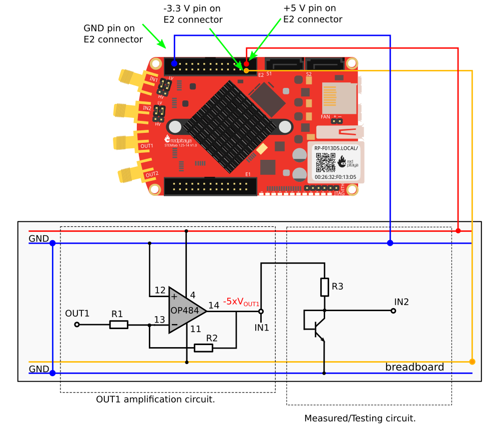
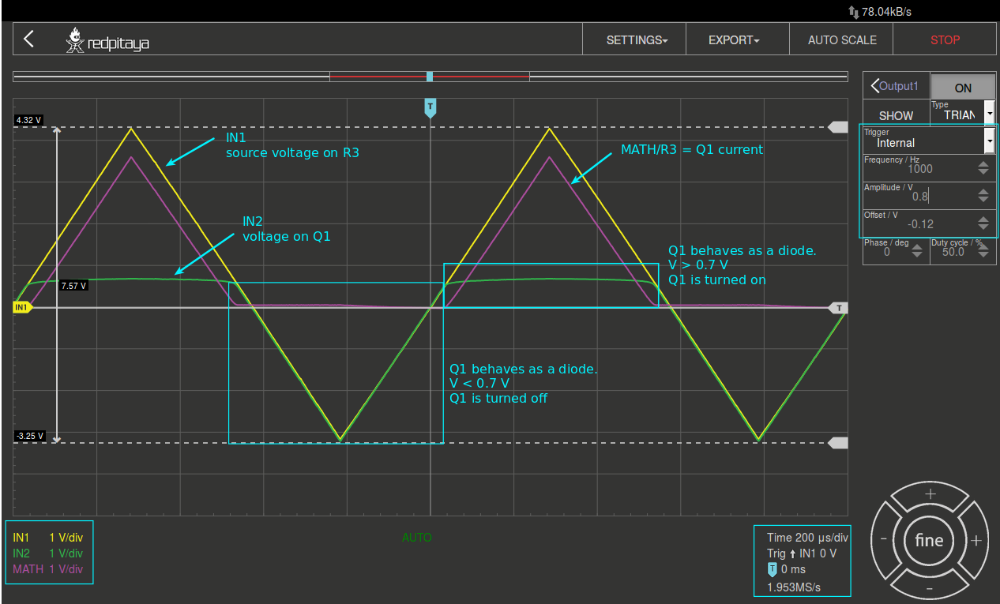

# Der BJT als Diode

## Zielsetzung

Der Zweck dieses Versuchs ist es, die Strom- und Spannungseigenschaften eines als Diode geschalteten Bipolartransistors
(engl. Bipolar Junction Transistor, BJT) zu untersuchen.

```{admonition}
Die für die Versorgungsspannungen von +5 V, -3,3 V und +3,3 V verwendeten Steckerstifte des STEMLab's sind
in der Dokumentation aufgeführt.

Die STEMlab-Ausgänge können Spannungssignale mit einem maximalen Ausgangsbereich von $\pm$ 1 V (2 Vpp) erzeugen. Für
diesen Versuch sind höhere Signalamplituden erforderlich. Aus diesem Grund wird ein Operationsverstärker (Opamp) als
invertierender Verstärker eingesetzt, um die Signale der Ausgänge OUT1 und OUT2 für einen Spannungshub von +4,7 V bis
-3,2 V zu verstärken. Der Opamp wird vom STEMlab aus mit +5 V und -3,3 V versorgt. Die Verstärkung des Opamps wird auf
$\approx$ 5 gesetzt, wobei $R_i$ = 2,2 k $\Omega$ und $R_f$ = 10 k $\Omega$.
```

## Materialien

* Red Pitaya STEMlab
* OP484
* 1 k $\Omega$ Widerstand
* 10 k $\Omega$ Widerstand
* 2,2 k $\Omega$ Widerstand
* Kleinsignal npn-Transistor (2N3904)
* Kleinsignal pnp-Transistor (2N3906)
* Platine
* Labornetzteil

Ein npn-Transistor, der wie in [Figure](22_fig_01.html#22_fig_01) gezeigt angeschlossen ist, verhält sich wie eine Diode.
Dies kann durch die Verwendung der Oszilloskop- und Signalgenerator-App gezeigt werden.




```{admonition} 
Beachten Sie, dass die in [Figure](22_fig_01.html#22_fig_01) (links) gezeigte Verstärkerschaltung nicht das Hauptthema
dieses Versuchs ist. Diese Schaltung wird nur hinzugefügt, um das Signal OUT1 zu verstärken; von hier an können Sie den
Punkt -5 $\times V_{OUT1}$ als Bezugspotenzial betrachten.
```

## Verfahren

Im Labor in Raum E 507 ist an jedem Messplatz eine Platine, wie in [Figure](22_fig_02.html#22_fig_02) gezeigt, an ein STEMlab
angeschlossen, wobei $R_1$ = 2,2 k $\Omega$, $R_2$ = 10 k $\Omega$ und $R_3$ = 1 k $\Omega$. 


```{warning} 
Bevor Sie eigene Schaltungen, entweder auf dem Steckbrett oder einer eigenen Platine, an die STEMlab-Pins -3,3V und
+3,3V anschließen, überprüfen Sie sorgfältig die Polarität Ihrer Schaltung. Die Spannungsversorgungsstifte -3,3V und
+3,3V haben keine Schutzschaltung und können im Falle eines Kurzschlusses beschädigt werden.
```


* Starten Sie die Oszilloskop- und Signalgenerator-App

* Stellen Sie im Menü OUT1-Einstellungen den Amplitudenwert auf 0,8 V, den DC-Offset auf -0,12 V und die Frequenz auf 1 kHz ein, um die Eingangsspannung anzulegen. Wählen Sie im Wellenform-Menü TRIANGLE, deaktivieren Sie SHOW und wählen Sie ENABLE.

* Stellen Sie sicher, dass IN1, IN2 und MATH V/div auf der linken unteren Seite des Bildschirms auf 1 V/div eingestellt sind. Sie können V/div einstellen, indem Sie den gewünschten Kanal auswählen und die vertikalen +/- Button rechts unten verwenden. 

* Setzen Sie den t/div Wert auf 200 us/div. Sie können t/div mit den horizontalen +/- Button einstellen.

* Stellen Sie unter MATH-Kanaleinstellungen folgendes ein: IN1-IN2 und wählen Sie ENABLE.

* Stellen Sie unter den Menüeinstellungen IN1 und IN2 den Messtaster auf x10 und den vertikalen Offset auf 0.




Aus [Figure](22_fig_03.html#22_fig_03) ist ersichtlich, dass der npn-Transistor in der in
[Figure](22_fig_01.html#22_fig_01) gezeigten Konfiguration sich wie eine Diode verhält. Vergleichen Sie die Ergebnisse
mit  den Diodenmessungen aus dem Diodenversuch.


## IV-Kurvenmessungen

Da sich ein Bipolartransistor wie eine Diode verhalten kann (vgl. Konfiguration in [Figure](22_fig_01.html#22_fig_01)),
können sie die IV-Charakteristik mit den gleichen Methoden wie im Diodenexperiment ermitteln, also mit der
Oszilloskop-App im Web-Browser, mit einem SCPI-Skript und mit eine Jupyter Notebook auf dem STEMlab.


Wenn Sie erfolgreich ein neues Jupyter-Notebook erstellt haben, kopieren Sie den untenstehenden Code in eine Zelle und
führen diese dann aus. Der untenstehende Code erzeugt das gleiche Signal wie in [Figure](22_fig_05.html#22_fig_05), aber
er zeichnet sie in einam XY-Diagramm auf, wobei die x-Achse die Diodenspannung $IN_2$ und die y-Achse den Diodenstrom
$I_D = I_C = (IN_1 - IN_2) / R_3$ darstellt. 


```python
# Import libraries
from redpitaya.overlay.mercury import mercury as overlay

from bokeh.io import push_notebook, show, output_notebook
from bokeh.models import HoverTool, Range1d, LinearAxis, LabelSet, Label
from bokeh.plotting import figure, output_file, show
from bokeh.resources import INLINE
output_notebook(resources=INLINE)

import numpy as np

# Initialize fpga modules
fpga = overlay()
gen0 = fpga.gen(0)
osc = [fpga.osc(ch, 1.0) for ch in range(fpga._MNO)]

# Configure OUT1 generator channel
gen0.amplitude = 0.8
gen0.offset = -0.12
gen0.waveform = gen0.sawtooth(0.5)
gen0.frequency = 2000
gen0.start()
gen0.enable = True
gen0.trigger()

# R1 resistor value
R1 = 1000

# Configure IN1 and IN2 oscilloscope input channels
for ch in osc:
    ch.filter_bypass = True

    # data rate decimation
    ch.decimation = 10

    # trigger timing [sample periods]
    N = ch.buffer_size
    ch.trigger_pre = 0
    ch.trigger_post = N

    # osc0 is controlling both channels
    ch.sync_src = fpga.sync_src["osc0"]
    ch.trig_src = fpga.trig_src["osc0"]

    # trigger level [V], edge ['neg', 'pos'] and holdoff time [sample periods]
    ch.level = 0.01
    ch.edg = 'pos'
    ch.holdoff = 0

    # Initialize diode current and voltage
    V = I = np.zeros(N)

    # Plotting
    hover = HoverTool(mode='vline', tooltips=[("V", "@x"), ("I", "@y")])
    tools = "wheel_zoom, box_zoom, reset,pan"
    p = figure(plot_height=500,
               plot_width=900,
               title="XY plot of transistor VI characteristic",
               toolbar_location="right",
               tools=(tools, hover))
    p.xaxis.axis_label = 'Voltage [V]'
    p.yaxis.axis_label = 'Current [mA]'
    r = p.line(V, I, line_width=1, line_alpha=0.7, color="blue")

    # get and explicit handle to update the next show cell
    target = show(p, notebook_handle=True)
```

Erstellen Sie eine neue Zelle (Einfügen -> Zelle darunter) und kopieren Sie den Code von unten hinein.


```python
# Measuring I, V  and re-plotting
while True:
    # reset and start
    osc[0].reset()
    osc[0].start()

    # wait for data
    while (osc[0].status_run()):
        pass
    V0 = osc[0].data(N-100)*10  # IN1 signal
    V1 = osc[1].data(N-100)*10  # IN2 signal
    I = ((V0-V1)/R1)*1E3        # 1E3 convert to mA
    r.data_source.data['x'] = V0
    r.data_source.data['y'] = I

    push_notebook(handle=target)
```

Führen Sie Zelle 1 und Zelle 2 aus. Zelle 2 ist eine Hauptschleife für die Erfassung und Neuaufnahme. Wenn Sie
die Erfassung stoppen, führen Sie einfach nur Zelle 2 aus, um die Messungen erneut zu starten.

Nach dem Ausführen des obigen Codes sollten Sie die IV-Charakteristik, wie in [Figure](22_fig_05.html#22_fig_05) gezeigt, erhalten. 


In [Figure](22_fig_05.html#22_fig_05) ist die in einer Diodenkonfiguration gemessene IV-Charakteristik eines BJT dargestellt.

Vergleichen sie diese Ergebnisse mit der IV-Charakteristik der pn-Diode. Es sollte eine Hysterese sichtbar sein.
Überlegen sie, warum Bipolartransistoren als Dioden verwendet werden können.


