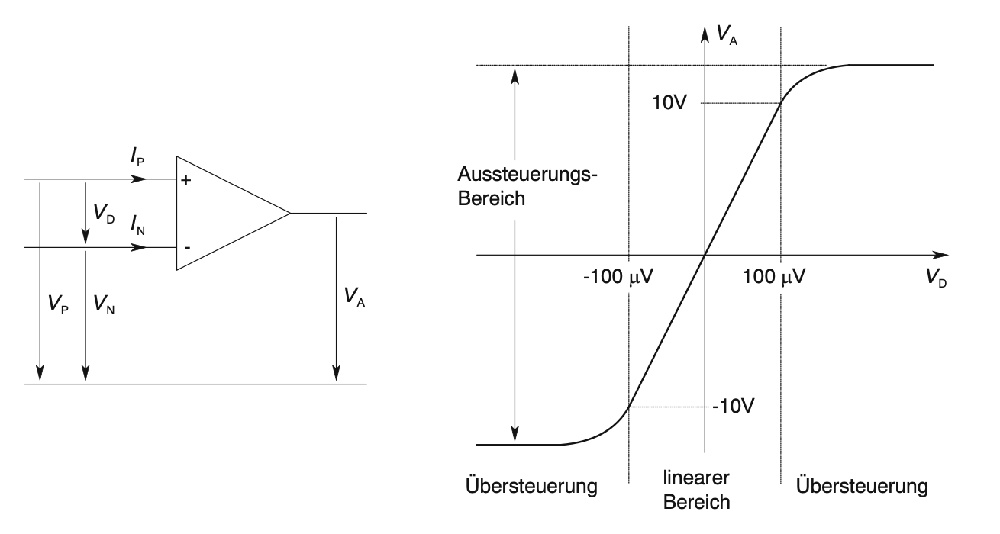
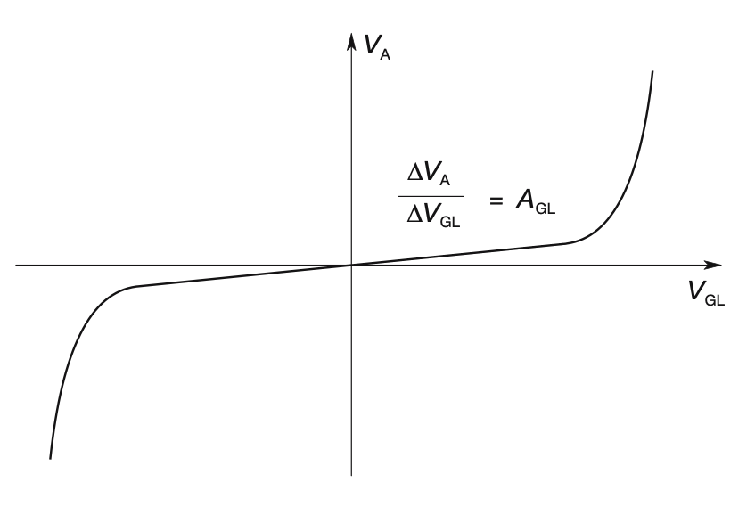
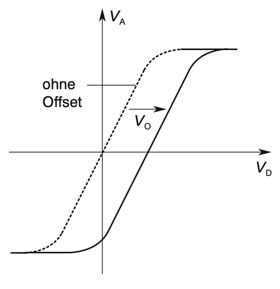
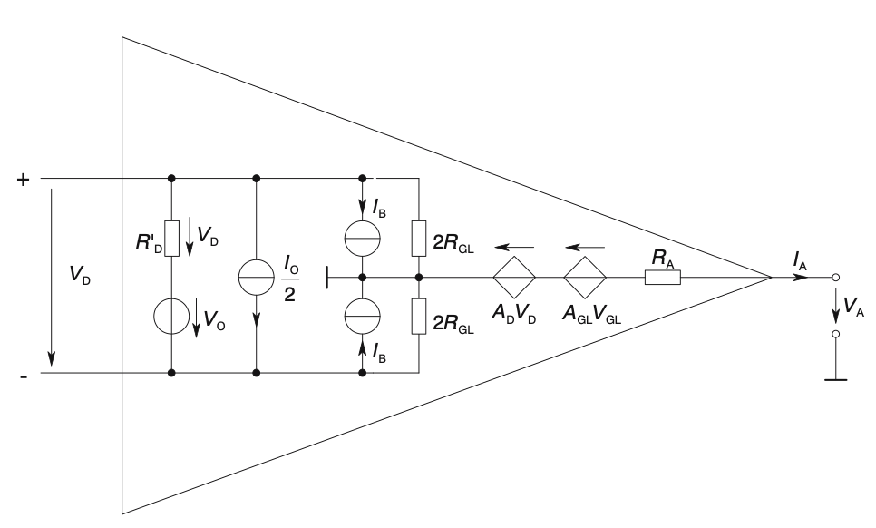

# Operationsverstärker

## Schaltung und Übertragungskennlinie

## Prinzipien und Kenndaten (1)

## Ausführungen

Bipolar\-OP‘s: Operationsverstärker in bipolarer Technologie

BiFET\-OP‘s: Operationsverstärker in BiCMOS\-Technologie

CMOS\-OP‘s: Operationsverstärker in CMOS\-Technologie

## Frequenzverhalten (1)

\(a\) Elementares Modell		\(b\) Makromodell

## Ersatzschaltungen/Makromodelle

Für die Schaltungssimulation

Ref\. Burr\-Brown\, „SPICE Based Macromodels“\, AB\-020F\, SBFA009 \(TI\)

[https://www\.electronicdesign\.com/technologies/analog/article/21806271/spice\-it\-up\-understanding\-and\-using\-opamp\-macromodels](https://www.electronicdesign.com/technologies/analog/article/21806271/spice-it-up-understanding-and-using-opamp-macromodels)

## Kleinsignalanalyse / Vierpolkenngrößen

Leitwertparameter eines Vierpols / Zweitors

[Linearisierung](https://de.wikipedia.org/wiki/Linearisierung) der Schaltungen\, Abbruch der [Taylorreihe](https://de.wikipedia.org/wiki/Taylorreihe) nach dem ersten Glied\.

Ref\. Kap\. 2\, Elektronische Bauelemente\,  Reisch\, 2007

## Kenngrößen beschalteter Vierpole

Eingangsimpedanz\, Ausgangsimpedanz\, Übertragungsfaktor

## Lineare Grundschaltungen
