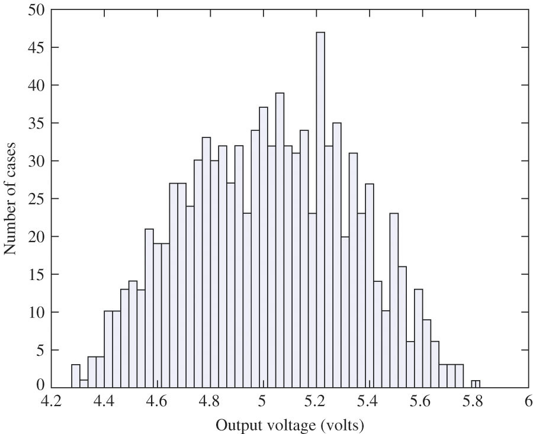

# Variationen von elektronischen Bauteilen

## Circuit Element Variations

* All electronic components have manufacturing tolerances\.
* Resistors can be purchased with 10%\, 5%\, and 1% tolerance\.  \(IC resistors are often 10%\.\)
* Capacitors can have asymmetrical tolerances such as \+20%/\-50%\.
* Power supply voltages typically vary from 1% to 10%\.
* Device parameters will also vary with temperature and age\. Circuits must be designed to accommodate these
  variations\. 
* We will use worst\-case and Monte Carlo \(statistical\) analysis to examine the effects of component parameter
  variations\.

## Tolerance Modeling

For symmetrical parameter variations:

$$
P_{nom} (1 - \varepsilon) \leq P \leq P_{nom} (1 + \varepsilon)
$$

For example\, a $10\,k\Omega$ resistor with $\pm 5%$ tolerance could take on the following range of values: 

$$
10k\Omega (1 - 0.05) \leq R \leq 10k\Omega (1 + 0.05)
$$

$$
9500 \Omega \leq R \leq 10500 \Omega
$$

## Circuit Analysis with Tolerances

* Worst-case analysis
  * Parameters are manipulated to produce the worst-case min and max values of desired quantities.
  * This can lead to over design since the worst\-case combination of parameters is rare.
  * It may be less expensive to discard a rare failure than to design for 100% yield.

* Monte-Carlo analysis
  * Parameters are randomly varied to generate a set of statistics for desired outputs\.
  * The design can be optimized so that failures due to parameter variation are less frequent than failures due to other
  mechanisms\.
  * In this way\, the design difficulty is better managed than a worst\-case approach\.

## Worst Case Analysis Example

__Problem:__

Find the nominal and worst\-case values for output voltage and source current\.

__Solution:__

Known Information and Given Data: Circuit topology and values in figure\.

Unknowns:

Approach:  Find nominal values and then select $R_1$, $R_2$, and $V_I$ values to generate extreme cases of the
unknowns\.

Assumptions: None\.

Analysis: Next slides

Nominal voltage solution:

## Worst-Case Analysis Example (cont.)

Nominal Source current:

Rewrite VO to help us determine how to find the worst\-case values\.

$V_O$ is maximized for max $V_I$, $R_1$ and min $R_2$\.

$V_O$ is minimized for min $V_I$, $R_1$, and max $R_2$.

Worst-case source currents:

Check of Results: The worst-case values range from 14-17 percent above and below the nominal values\.

The sum of the three element tolerances is 20 percent\, so our calculated values appear to be reasonable\.

## Monte Carlo Analysis

Parameters are varied randomly and output statistics are gathered\.

We use programs like MATLAB\, Python\, SPICE\, or a spreadsheet to complete a statistically significant set of
calculations\.

For example\, with Excel\, a resistor with a nominal value $R_{nom}$ and tolerance can be expressed as:

$$
R = R_{nom} (1 + 2\varepsilon(rand() - 0.5))
$$

The rand() function returns random numbers uniformly distributed between 0 and 1\.

## Monte Carlo Analysis Results

Histogram of output voltage from 1000 case Monte-Carlo (MC) simulation\.

|                    | $V_O$/V |
|:-------------------|:-------:|
| Average            |  4.96   |
| Nominal            |  5.00   |
| Standard Deviation |  0.30   |
| Maximum            |  5.70   |
| WC Maximum         |  5.87   |
| Minimum            |  4.37   |
| WC Minimum         |  4.20   |
|                    |         |

## Monte Carlo Analysis Example

__Problem:__

Perform a Monte-Carlo analysis and find the mean\, standard deviation\, min\, and max for $V_O$, $I_I$,
and power delivered from the source\.

__Solution:__

Known Information and Given Data: Circuit topology and values in figure\.

Unknowns: The mean\, standard deviation\, min\, and max for $V_O$, $I_I$, and $P_I$.

Approach:  Use a program of your choise, e.g. MATLAB, Python or spreadsheet, to evaluate the circuit equations with
random parameters\.

Assumptions: None\.

Analysis: Next slides …

Monte-Carlo parameter definitions:

## Monte Carlo Analysis Example (cont.)

Monte Carlo parameter definitions:

Circuit equations based on Monte Carlo parameters:

|            |  Avg  | Nom\. |  Std   |  Max  | WC\-max |  Min  | WC\-Min |
|:-----------|:-----:|:-----:|:------:|:-----:|:-------:|:-----:|:-------:|
| $V_o$ (V)  | 4.96  | 5.00  |  0.30  | 5.70  |  5.87   | 4.37  |  4.20   |
| $I_I$ (mA) | 0.276 | 0.278 | 0.0173 | 0.310 |  0.322  | 0.242 |  0.238  |
| $P$ (mW)   | 4.12  | 4.17  | 0.490  | 5.04  |  \-\-   | 3.29  |  \-\-   |
|            |       |       |        |       |         |       |         |

## Temperature Coefficients

Most circuit parameters are temperature sensitive\.

$$
P = P_{nom} (1 + \alpha_1 \Delta T + \alpha_2 \Delta T^2)
$$ 

where $\Delta T = T-T_{nom}$ and $P_{nom}$ is defined at $T_{nom}$.

Most versions of SPICE allow for the specification of TNOM, T, TC1($\alpha_1$), TC2($\alpha_2$).

SPICE temperature model for resistor:

$$
R(T) = R(TNOM) \cdot [1 + TC1 \cdot (T - TNOM) + TC2 \cdot (T - TNOM)^2]
$$

Many other components have similar models\.

## Numeric Precision

Most circuit parameters vary from less than $\pm 1%$ to greater than $\pm 50%$.

As a consequence\, more than three significant digits is meaningless\.

Results in the text will be represented with three significant digits:  2.03 mA, 5.72 V, 0.0436 $\mu$A, and so on\.

However\, extra guard digits are normally retained during calculations\.

## Tolerances & Worst-Case Analysis Example

__Problem:__  Find worst-case values of $I_C$ and $V_{CE}$ in the circuit below\.

__Given data: __ $\beta_{FO}$ = 75 with 50% tolerance, $V_A$ = 50 V, 5% tolerance on $V_{CC}$, 10% tolerance for each
resistor\. $R_1$ = 18 kW, $R_2$ = 36 kW. 

__Simplified Analysis:__

To maximize $I_C$, $V_{EQ}$ should be maximized\, $R_E$ should be minimized and the opposite for minimizing $I_C$.
Extremes of $R_E$ are: 14.4 kW and  17.6 kW\. 

To maximize $V_{EQ}$, $V_{CC}$ and $R_1$ should be maximized\, $R_2$ should be minimized and opposite for minimizing
$V_{EQ}\.

Quelle: [@jaeger2023], Kap. 4, Ex. 4.11

## Tolerances & Worst-Case Analysis Example (cont.)

Quelle: [@jaeger2023], Kap. 4, Ex. 4.11

Extremes of $V_{EQ}$ are: 4.78 V and 3.31 V\.

Extremes for $I_C$ are: 283 mA and 148 mA\.

To maximize $V_{CE}$, $I_C$ and $R_C$ should be minimized\, and opposite for minimizing $V_{EQ}$\.

Extremes of $V_{CE}$ are: 7.06 V (forward-active region) and 0.471 V (saturated, hence calculated values for
$V_{CE}$ and $I_C$ actually not correct\)\.

Quelle: [@jaeger2023], Kap. 4, Ex. 4.11

## Tolerances - Monte Carlo Analysis

In real circuits\, it is unlikely that various components will reach their extremes at the same time\, instead they will
have some statistical distribution\. Hence worst\-case analysis over\-estimates extremes of circuit behavior\.

In Monte Carlo analysis\, values of each circuit parameter are randomly selected from possible distributions of
parameters and used to analyze the circuit\.

Random parameter sets are generated\, and the statistical behavior of circuit is built up from the analysis of many test
cases\.

## Tolerances - Monte Carlo Analysis Example

For each case: Assign random values to all circuit elements

\begin{align}
V_{CC} &= 12 (1 + 0.1(rand() - 0.5)) \\
R_1 &= 18\,k\Omega (1 + 0.2(rand() - 0.5)) \\
R_2 &= 36\,k\Omega (1 + 0.2(rand() - 0.5)) \\
R_E &= 16\,k\Omega (1 + 0.2(rand() - 0.5)) \\
R_C &= 22\,k\Omega (1 + 0.2(rand() - 0.5)) \\
\beta_F &= 75 (1 + (rand() - 0.5))
\end{align}

Then calculate resulting currents and voltages

\begin{align}
V_{EQ} &= V_{CC} \frac{R_1}{R_1 + R_2} \\
R_{EQ} &= \frac{R_1 R_2}{R_1 + R_2} \\
I_B &= \frac{V_{EQ} - V_{BE}}{R_{EQ} + (\beta_F + 1)R_E} \\
I_C &= \beta_F I_B \\
I_E &= (\beta_F + 1) I_B \\
V_{CE} &= V_{CC} - I_C R_C - I_E R_E
\end{align}

Note: Assume constant VBE = 0\.7 for simplicity\.

Quelle: [@jaeger2023], Kap. 4, Ex. 4.12

## Tolerances - Monte Carlo Analysis

Full results of Monte-Carlo analysis of 500 cases of the 4\-resistor bias circuit yields mean values of 207 mA and
4.06 V for $I_C$ and $V_{CE}$ respectively which are close to values originally estimated from nominal circuit elements\.
  
Standard deviations (std) are 19.6 mA and 0.64 V respectively\.
The worst\-case calculations lie well beyond the extremes of the distributions

Note that circuit never saturates in the Monte-Carlo analyses

Quelle: [@jaeger2023], Kap. 4, Ex. 4.12

## LTSpice Monte-Carlo Analysis (mc)

[SPICE Man Net](https://spiceman.net/ltspice-monte-carlo-analysis/)

## LTSpice Worst-Case (wc) and Monte-Carlo (mc)

[Analog Devices ](https://www.analog.com/en/technical-articles/ltspice-worst-case-circuit-analysis-with-minimal-simulations-runs.html) 

